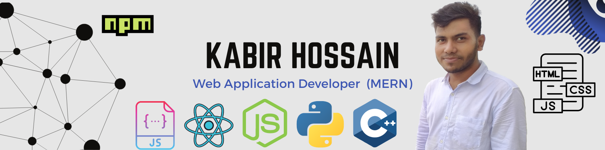

### Hi there ✋, I'm Kabir Hossain 👋

I am an accomplished full-stack (MERN) web application developer and WordPress developer, who constantly looks for new challenges to tackle in the real world. In addition to working with Fiverr and Upwork, Kabir is also a BBA graduate, worked on some business projects as a team leader.  

:coffee: &emsp;Connect with me!

   

:hearts: &emsp;I enjoy programming. 
:computer: &emsp;Most used line of code `console.log("hello world")`  
🤔 &emsp;I’m looking for people who can help me to generate new idea for innovation. 
:e-mail: &emsp;How to reach me: kabir00pk@gmail.com. 
😍 &emsp;Highly intersted to collaboration.  
⚡ &emsp;Fun fact: I am a core traveler and a liitle bit foodie also.

#### Things I code with

                     

- 🔭 I’m currently working on this page. 

